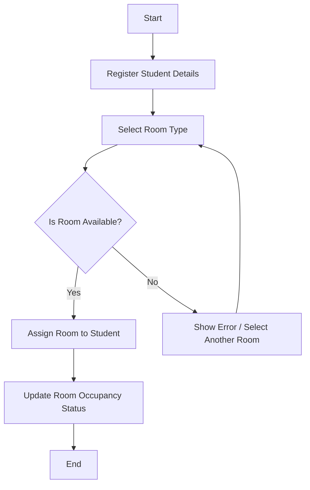
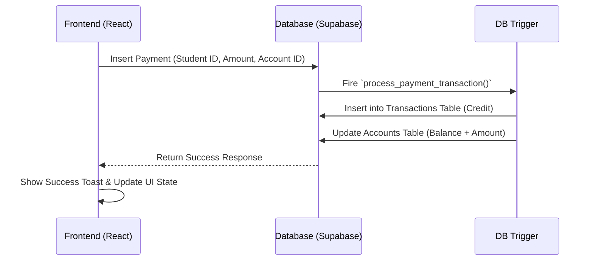
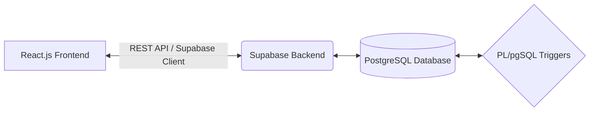
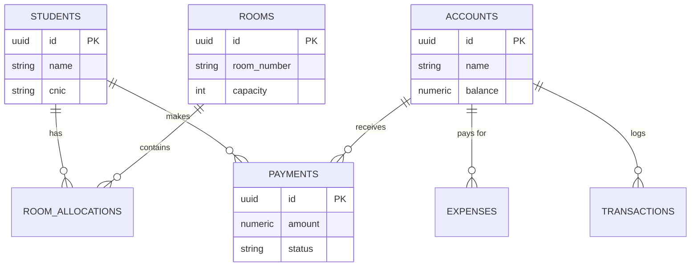

# Final Year Project Report: Uninest Hostel Management System

---

**Project Title:** Uninest - Hostel Management System  
**Developed By:** [Your Name / Team Members]  
**Supervisor:** [Supervisor Name]  
**University:** [Your University Name]  
**Date:** [Date]  

---

## Abstract
The rapid digitalization of administrative tasks has become essential for educational institutions and accommodation businesses. "Uninest" is a modern, web-based Hostel Management System designed to automate and streamline the daily operations of a hostel facility. The system provides a centralized platform for managing room allocations, student records, and financial transactions. Built using a reactive frontend (React.js, Tailwind CSS) and a robust backend (Supabase PostgreSQL), Uninest eliminates the inefficiencies of manual record-keeping. The integration of database-level triggers ensures 100% accuracy in financial accounting by automatically updating account balances upon fee collection or expense logging. This report details the system's analysis, design, implementation, and testing phases.

---

## Table of Contents
1. [Chapter 1: Introduction](#chapter-1-introduction)
2. [Chapter 2: Literature Review](#chapter-2-literature-review)
3. [Chapter 3: System Analysis & Requirements](#chapter-3-system-analysis--requirements)
4. [Chapter 4: UML Diagrams & Modeling](#chapter-4-uml-diagrams--modeling)
5. [Chapter 5: System Design & Architecture](#chapter-5-system-design--architecture)
6. [Chapter 6: Implementation & Tech Stack](#chapter-6-implementation--tech-stack)
7. [Chapter 7: User Manual & Interface](#chapter-7-user-manual--interface)
8. [Chapter 8: System Testing](#chapter-8-system-testing)
9. [Chapter 9: Conclusion & Future Work](#chapter-9-conclusion--future-work)

---

## Chapter 1: Introduction

### 1.1 Background
Hostel management involves a multitude of administrative tasks, including student registration, room assignment, fee collection, and expense tracking. Traditionally, these tasks are handled manually using physical ledgers, which is time-consuming and prone to errors. Uninest was conceptualized to solve these problems by providing an intuitive, digital interface that automates hostel administration.

### 1.2 Problem Statement
Manual hostel management faces several critical issues:
- **Data Loss:** Physical ledgers are vulnerable to damage or loss.
- **Financial Inaccuracies:** Calculating outstanding dues, partial payments, and daily expenses manually leads to human error.
- **Inefficient Room Tracking:** Finding available beds in single, double, or triple-sharing rooms requires cross-referencing multiple pages.
- **Lack of Analytics:** Managers lack real-time insights into occupancy rates and revenue.

### 1.3 Objectives
- To develop a secure, cloud-based application for hostel management.
- To automate room allocation based on real-time availability.
- To implement a strict double-entry accounting system where payments automatically reflect in cash/bank balances.
- To provide a dashboard with visual analytics for occupancy and revenue.

### 1.4 Scope
The current iteration of Uninest is designed for single-hostel operations. It targets hostel managers and administrators, providing them with complete control over students, rooms, finances, and inquiries. Multi-branch management and a dedicated student-facing portal are outside the current scope.

---

## Chapter 2: Literature Review

### 2.1 Existing Systems
We analyzed several local and commercial property management systems. Most local hostels use either MS Excel or legacy desktop software built on VB.NET/MS Access.

### 2.2 Feature Comparison

| Feature | Legacy Systems (Excel/Access) | Enterprise ERPs | **Uninest (Proposed)** |
| :--- | :--- | :--- | :--- |
| **Cost** | Low | Extremely High | **Low (Open Source Tech)** |
| **Accessibility** | Local Machine Only | Cloud | **Cloud (Anywhere access)** |
| **Financial Automation** | Manual Entry | Fully Automated | **Fully Automated via DB Triggers** |
| **User Interface** | Outdated / Clunky | Complex / Steep Learning | **Modern, Intuitive, Fast** |

---

## Chapter 3: System Analysis & Requirements

### 3.1 Hardware Requirements
- **Server:** Cloud Hosting via Supabase (Requires 0 physical hardware from the user).
- **Client:** PC/Laptop with minimum Core i3, 4GB RAM, and Internet connectivity.

### 3.2 Software Requirements
- **Frontend:** React.js, Tailwind CSS, Vite.
- **Backend:** Supabase (PostgreSQL).
- **Client Environment:** Modern Web Browser (Chrome, Firefox, Safari).

### 3.3 Functional Requirements
1. **Authentication:** Secure login for Managers/Admins.
2. **Student Management:** CRU (Create, Read, Update) operations for student profiles.
3. **Room Allocation:** System must validate room capacity before checking a student in.
4. **Finance Tracking:** System must record Payments (Credits) and Expenses (Debits).
5. **Ledger Updates:** Database must automatically update the respective Account balance (Cash/Bank) when a transaction occurs.

### 3.4 Non-Functional Requirements
1. **Reliability:** Data must be backed up automatically (handled by Supabase).
2. **Performance:** UI interactions should reflect changes instantly without page reloads.
3. **Usability:** The interface must be self-explanatory with minimal training required.

---

## Chapter 4: UML Diagrams & Modeling

### 4.1 Use Case Diagram
The Use Case diagram illustrates the interaction between the system's primary actor (Manager) and the system modules.

```mermaid
usecaseDiagram
    actor Manager
    
    package "Uninest System" {
        usecase "Login" as UC1
        usecase "Manage Students" as UC2
        usecase "Allocate Rooms" as UC3
        usecase "Record Payment" as UC4
        usecase "Log Expense" as UC5
        usecase "View Dashboard Reports" as UC6
    }
    
    Manager --> UC1
    Manager --> UC2
    Manager --> UC3
    Manager --> UC4
    Manager --> UC5
    Manager --> UC6
```

### 4.2 Activity Diagram: Room Allocation
This describes the flow of allocating a room to a new student.



### 4.3 Sequence Diagram: Payment Processing
This details how the backend handles financial data asynchronously using triggers.



---

## Chapter 5: System Design & Architecture

### 5.1 Architecture Diagram
Uninest utilizes a Client-Server API architecture.



### 5.2 Entity Relationship (ER) Diagram
The database strictly follows normalization rules.



---

## Chapter 6: Implementation & Tech Stack

### 6.1 Frontend Implementation
The frontend is initialized using **Vite**, providing an extremely fast development server. We utilized **React.js** for building declarative, component-based UIs. State management is handled primarily via React hooks (`useState`, `useEffect`). Routing is achieved via `react-router-dom`.

For styling, **Tailwind CSS** was chosen. Tailwind's utility classes allow for rapid styling without the overhead of external CSS files, resulting in a cohesive design system.

### 6.2 Backend Implementation (Supabase)
Supabase acts as our Backend-as-a-Service (BaaS). The core logic relies on PostgreSQL. We implemented custom PL/pgSQL functions and triggers.

**Example Trigger Logic:**
To prevent the ledger from falling out of sync, the following trigger runs automatically when a payment is inserted:
```sql
create function process_payment_transaction() returns trigger as $$
begin
  -- Insert into master transaction log
  insert into public.transactions (account_id, type, amount, reference)
  values (new.account_id, 'credit', new.amount, 'payment');
  
  -- Update account balance
  update public.accounts set balance = balance + new.amount
  where id = new.account_id;
  
  return new;
end;
$$ language plpgsql;
```
This ensures financial integrity at the database level, meaning the frontend never manually updates account balances.

---

## Chapter 7: User Manual & Interface

*(Note for Student: Paste the screenshots of your application below the corresponding descriptions in your Word document)*

### 7.1 Administrator Dashboard
The dashboard provides a bird's-eye view of the hostel. It includes Recharts graphs showing monthly revenue and cards displaying active students and available rooms.

**[INSERT SCREENSHOT: DASHBOARD PAGE]**

### 7.2 Student Directory
Displays a tabular list of all registered students, their contact details, and their current room assignment. Includes a search and filter mechanism.

**[INSERT SCREENSHOT: STUDENT LIST PAGE]**

### 7.3 Room Allocation
The interface where managers assign beds to students. It automatically prevents assignment if the room capacity (e.g., 2 beds for Double Sharing) is full.

**[INSERT SCREENSHOT: ROOM ALLOCATION MODAL]**

### 7.4 Financial Ledger (Payments & Accounts)
Shows a detailed history of payments collected and expenses incurred. The Accounts tab shows the real-time balance of Cash and Bank accounts.

**[INSERT SCREENSHOT: PAYMENTS/ACCOUNTS PAGE]**

---

## Chapter 8: System Testing

Systematic testing was conducted to ensure system stability.

### 8.1 Test Cases Table

| Test Case ID | Module | Scenario | Expected Result | Pass/Fail |
| :--- | :--- | :--- | :--- | :--- |
| TC-01 | Auth | Manager enters correct credentials | Redirected to Dashboard | Pass |
| TC-02 | Rooms | Allocate student to a full room | System denies allocation & shows error | Pass |
| TC-03 | Finance | Add a payment of Rs.5000 to Cash | Cash account balance increases by 5000 | Pass |
| TC-04 | Finance | Add an expense of Rs.1000 | Account balance decreases by 1000 | Pass |
| TC-05 | Students | Register student without CNIC | Form validation blocks submission | Pass |

---

## Chapter 9: Conclusion & Future Work

### 9.1 Conclusion
Uninest successfully achieves its goal of modernizing hostel administration. The integration of React for a seamless frontend and Supabase for a robust, trigger-based backend creates a highly reliable system. Administrators can now manage complex tasks like room allocations and double-entry accounting with a few clicks.

### 9.2 Future Enhancements
- **Multi-tenant Support:** Upgrade the database schema to support multiple hostel branches under one super-admin.
- **Student Portal & App:** Develop a React Native mobile app for students to log maintenance complaints and view fee vouchers.
- **Automated Notifications:** Integrate email/SMS APIs to automatically remind students of overdue rent.

---
**End of Report**
